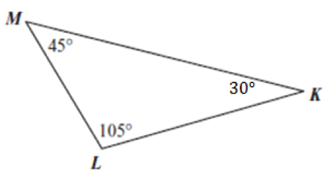

We are asked to find the measure of
\( \measuredangle JGH \), which is part of $GHJ$. Unfortunately, we don't
know any of the angle measures in that triangle, so we have to turn to
$KLM$ instead. In a triangle, the sum of the measures of all three
angles is 180°. Since we know the measures of two of the angles, we can
calculate the third angle like this:

Since the two triangles are congruent, written as \( GHJ \cong KLM \), their
corresponding angles are also congruent. That means that the measure of
\( \measuredangle JGH \) in the top triangle is the same as the measure of
its corresponding angle in the lower triangle.

But which angle corresponds to of \( \measuredangle JGH \)? The clue is in
how the triangles are named.

Since we are told that \( GHJ \cong KLM \), the order in which each
triangle is named tells us that:

$$\measuredangle G \cong \measuredangle K$$

$$\measuredangle H \cong \measuredangle L$$

$$\measuredangle J \cong \measuredangle M$$

So \( \measuredangle JGH \), which is another name for \( \measuredangle G \),
is congruent to \( \measuredangle K \). Since we found that
\( m \measuredangle K =30° \), then \( m \measuredangle G =30° \), which is choice
A.

You can review corresponding parts of congruent triangles here:

<http://www.virtualnerd.com/geometry/congruent-triangles/proof-asa-aas-hl/definition-cpctc>

<http://www.mathsisfun.com/geometry/triangles-congruent.html>
