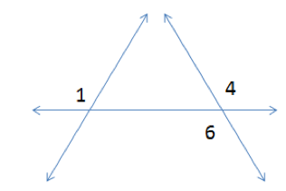

Line *h* is called the transversal to the two lines *f*
and *g*. $\angle 1$ and $\angle 3$ are called *corresponding angles.* If
$\angle 1 \cong \angle 3$, then *f* and *g* are parallel.

Regardless of the position of line *f*, $\angle 3 \cong \angle 5$
because they are *diagonal angles*. Together, that means that if
$\angle 1 \cong \angle 5$ then the two lines are parallel, which is
choice B.

$\angle 1$ and $\angle 7$ are diagonal angles, and are congruent
regardless of the position of line *g*, so $\angle 1 \cong \angle 7$
whether or not lines *f* and *g* are parallel. Choice D cannot be
correct.

Choices A and C. If $\angle 1 \cong \angle 4$, then we don't know
anything about whether *f* and *g* are parallel. For example, in this
diagram $\angle 1 \cong \angle 4$ but the two lines are not parallel.
$\angle 4 \cong \angle 6$, so the relationship of $\angle 1$ and
$\angle 6$ also do not tell us about whether or not the lines are
parallel.

When two parallel lines are crossed by a transversal, there are many
special relationships among the angles. You can review them here:
<http://www.mathsisfun.com/geometry/parallel-lines.html>
